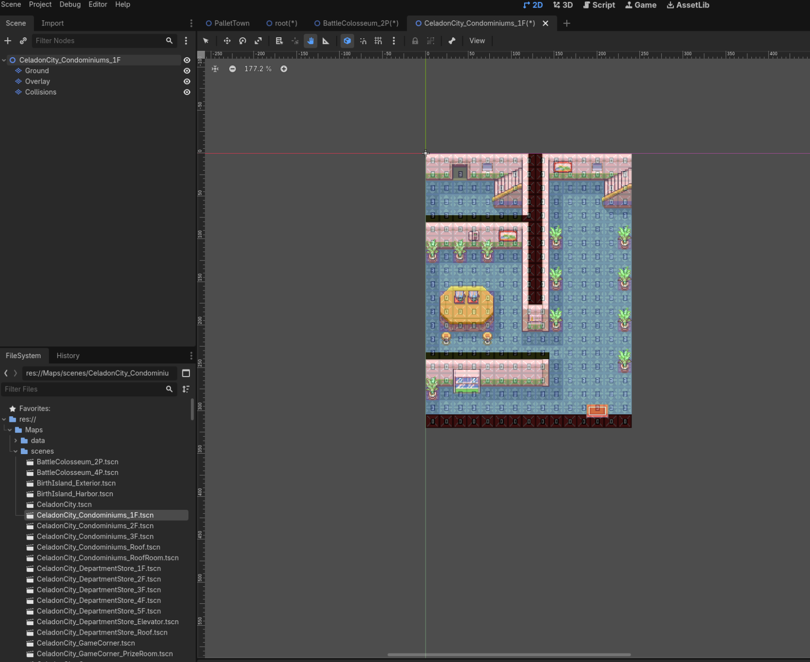
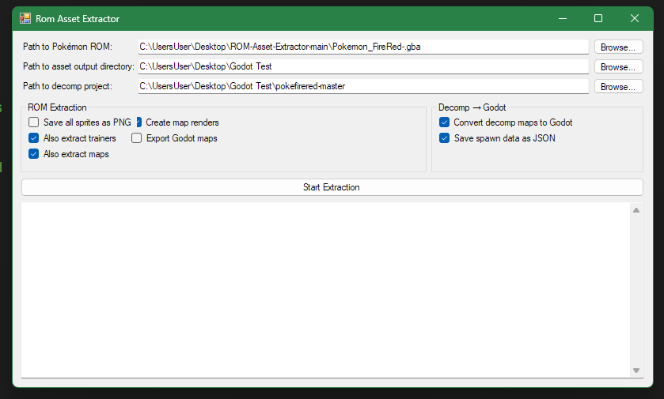
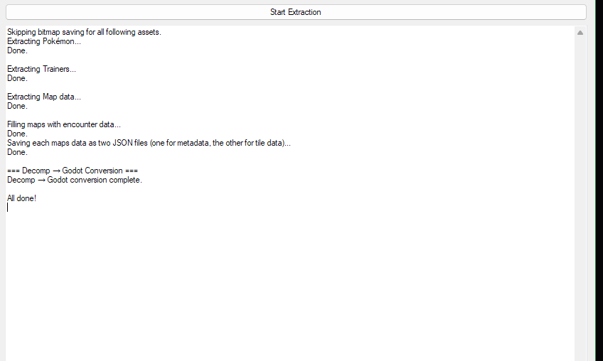

# FireRed to Godot

Extract maps, sprites, and tilesets from Pokémon GBA ROMs and turn them into ready-to-use **Godot 4.3+** projects.

I forked [TheJjokerR's ROM-Asset-Extractor](https://github.com/TheJjokerR/ROM-Asset-Extractor) and built on top of it to add Godot export — so you can go straight from a ROM or a [pokefirered](https://github.com/pret/pokefirered) decomp into a Godot project with working TileMaps, TileSets, and map data.



---

## What You Need

- .NET Framework 4.7.2+
- Visual Studio 2019+ (or `dotnet build`)
- A Pokémon GBA ROM (FireRed, Ruby, or LeafGreen — English USA versions)
- **The [pret/pokefirered](https://github.com/pret/pokefirered) decompiled binary** — this is required for the tool to work. Clone or download it from [github.com/pret/pokefirered](https://github.com/pret/pokefirered) and build it following their instructions.

## Getting Started

1. Clone this repo
2. Open `RomAssetExtractor.sln` in Visual Studio
3. Restore NuGet packages and build

All build output goes to `./bin/Debug/` (or `./bin/Release/`) at the project root.

---

## Godot Export

There are two ways to get maps into Godot:

### From a ROM directly

`RomAssetExtractor.Godot` takes the extracted map data and generates a full Godot project — TileSet resources (`.tres`), TileMap scenes (`.tscn`), and JSON files with NPC positions, warps, and animation info.

### From a pokefirered decomp

`DecompToGodot` skips the ROM entirely and reads map data straight from a [pret/pokefirered](https://github.com/pret/pokefirered) decomp folder.

```
DecompToGodot.exe <decomp-path> <output-path> [map-filter]
```

For example:
```
DecompToGodot.exe C:\pokefirered-master C:\MyGodotProject\maps PalletTown,Route1
```

Either way, the output folder can be opened directly as a Godot 4.3+ project.

---

## Extracting Assets (CLI)

```
RomAssetExtractor.Cli.exe --rom "path/to/rom.gba"
```

| Flag | What it does | Default |
|------|-------------|---------|
| `--rom` / `-r` | Path to the GBA ROM **(required)** | — |
| `--output` / `-o` | Where to save extracted assets | `output` |
| `--save-bitmaps` / `-sb` | Save sprite/tileset images | `True` |
| `--save-trainers` / `-st` | Save trainer data | `True` |
| `--save-maps` / `-sm` | Save map data | `True` |
| `--save-map-renders` / `-smr` | Render full map images | `False` |

## UI

There's also a Windows Forms GUI if you prefer clicking over typing:





---

## ROM Support

Only English (USA) ROMs are tested right now:

| Game | Status | ROM Code |
|------|--------|----------|
| FireRed | Partial | BPRE |
| Ruby | Partial | AXVE |
| LeafGreen | Partial | BPEE |
| Sapphire | Not yet | — |
| Emerald | Not yet | — |

You can add support for other versions by configuring the offsets in `pokeroms.yml`.

---

## Project Layout

| Folder | What's in it |
|--------|-------------|
| `RomAssetExtractor` | Core library — reads ROMs, extracts assets |
| `RomAssetExtractor.Cli` | Command-line tool |
| `RomAssetExtractor.UI` | Windows Forms GUI |
| `RomAssetExtractor.Godot` | Turns extracted maps into Godot scenes |
| `DecompToGodot` | Reads a pokefirered decomp and outputs Godot scenes |

---

## Credits

This project is a fork of [TheJjokerR/ROM-Asset-Extractor](https://github.com/TheJjokerR/ROM-Asset-Extractor) (GPL-3.0, Copyright 2021 TheJjokerR). Big thanks to the original work that made this possible.

Also credit to:
- [magical/pokemon-gba-sprites](https://github.com/magical/pokemon-gba-sprites/) — sprite extraction reference
- [jugales/pokewebkit](https://github.com/jugales/pokewebkit) — offset/address data
- [kaisermg5/jaae](https://github.com/kaisermg5/jaae) — tile extraction code
- Nintenlord's "unLZ-GBA replacement" — bitmap/PNG writing
- Nintendo / Creatures Inc. / GAME FREAK inc. — Pokémon is their trademark

## License

GPL-3.0 — see [LICENSE](LICENSE).

## Disclaimer

This is a personal project for learning. I'm not affiliated with Nintendo or Pokémon. Not legal advice. Use responsibly and respect copyright laws in your country.
