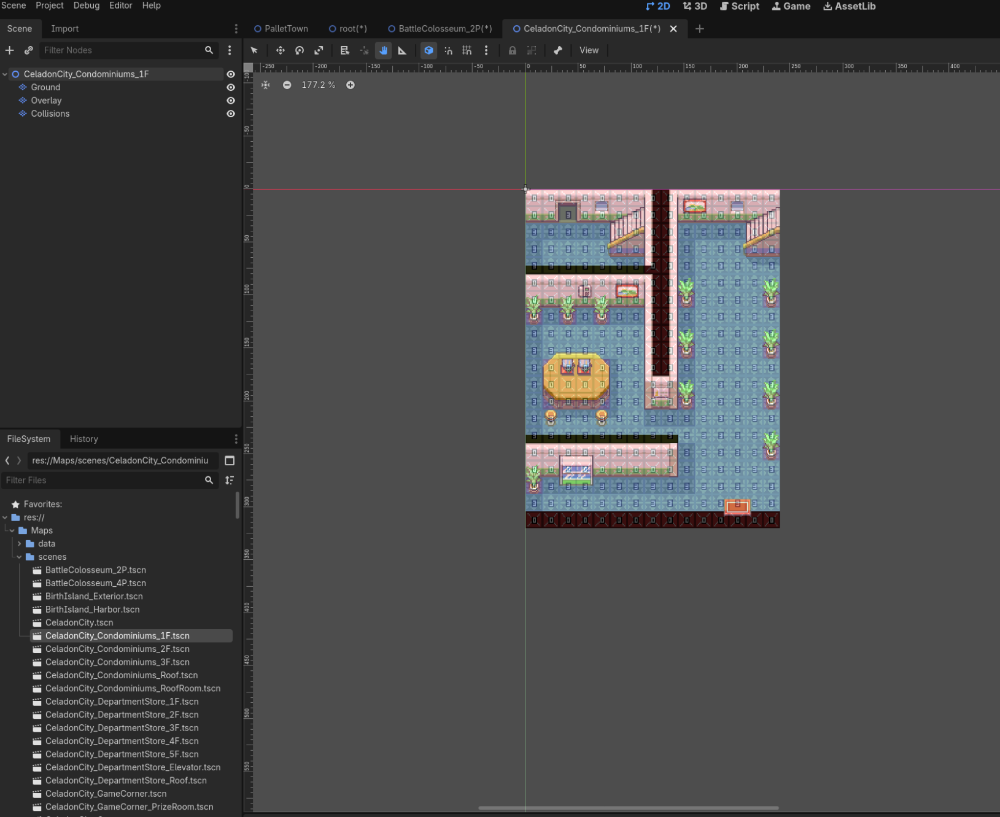
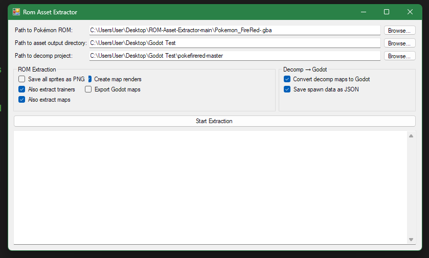
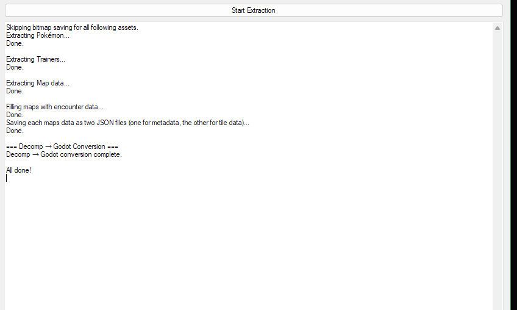

# FireRed to Godot

Extract maps, sprites, and tilesets from Pokémon GBA ROMs and turn them into ready-to-use **Godot 4.3+** projects.

I forked [TheJjokerR's ROM-Asset-Extractor](https://github.com/TheJjokerR/ROM-Asset-Extractor) and built on top of it to add Godot export — so you can go straight from a ROM or a [pokefirered](https://github.com/pret/pokefirered) decomp into a Godot project with working TileMaps, TileSets, and map data.



---

## What You Need

- .NET Framework 4.7.2+
- Visual Studio 2019+ (or `dotnet build`)
- A Pokémon GBA ROM (FireRed, Ruby, or LeafGreen — English USA versions)
- **The [pret/pokefirered](https://github.com/pret/pokefirered) decompiled binary** — this is required for the tool to work. Clone or download it from [github.com/pret/pokefirered](https://github.com/pret/pokefirered) and build it following their instructions.

## Getting Started

1. Clone this repo
2. Open `RomAssetExtractor.sln` in Visual Studio
3. Restore NuGet packages and build

All build output goes to `./bin/Debug/` (or `./bin/Release/`) at the project root.

---

## Godot Export

There are two ways to get maps into Godot:

### From a ROM directly

`RomAssetExtractor.Godot` takes the extracted map data and generates a full Godot project — TileSet resources (`.tres`), TileMap scenes (`.tscn`), and JSON files with NPC positions, warps, and animation info.

### From a pokefirered decomp

`DecompToGodot` skips the ROM entirely and reads map data straight from a [pret/pokefirered](https://github.com/pret/pokefirered) decomp folder.

```
DecompToGodot.exe <decomp-path> <output-path> [map-filter]
```

For example:
```
DecompToGodot.exe C:\pokefirered-master C:\MyGodotProject\maps PalletTown,Route1
```

Either way, the output folder can be opened directly as a Godot 4.3+ project.

### Decomp output layout

`DecompToGodot` writes one shared TileSet for the whole game. Every map scene points at the same file, so you edit a tileset once and every map picks it up.

```
project.godot
tilesets/
  world_tileset.tres     the only TileSet, used by every map
  world_tileset.json     which source holds which metatile, for runtime lookups
  atlases/
    general_ground.png   one Ground and one Overlay atlas per tileset
    general_overlay.png
    pallet_town_ground.png
    ...
    collision.png
scenes/PalletTown.tscn   Ground, Overlay and Collisions TileMapLayers
data/PalletTown.json     events, connections, behaviors, collision, elevation
```

How the shared TileSet is organised:

| Source id | What it holds |
|-----------|---------------|
| 0 | Collision overlay (atlas X = collision, atlas Y = elevation) |
| 1, 2 | General Ground, General Overlay |
| 3, 4 | Building Ground, Building Overlay |
| 5 and up | One Ground and Overlay pair per secondary tileset |

`world_tileset.json` lists the exact ids. The TileSet is always built from every layout in the decomp, so the ids stay the same even when you export a single map with a filter.

Each atlas follows the Porymap grid first (8 metatiles per row, in id order). Below that come two extra sections:

* **Borrowed metatiles.** Some Building metatiles (576 to 639) read tiles and palettes from the secondary tileset, so they look different in every building. Each secondary tileset that pairs with Building carries its own correct copy.
* **Animated metatiles.** Tile animations come straight from `src/tileset_anims.c`, so water, flowers, fountains, steam and the Vermilion Gym door all animate in the editor and in game. Each animated metatile sits at the start of a row with its frames to the right, using Godot's built in tile animation. Frame timings match the GBA. The plain grid still shows the first frame as a picture, but you paint the animated version.

Ground tiles carry the metatile attributes as TileSet custom data, so game code can read them straight from the map:

```gdscript
var data := $Ground.get_cell_tile_data(cell)
var behavior: int = data.get_custom_data("behavior")
```

Custom data layers: `metatile_id`, `behavior`, `terrain_type`, `encounter_type`, `layer_type`.

If you re-export into a folder made by an older version, you can delete the old `tiles/` folder and the old `tilesets/*_tileset.tres` files. Nothing uses them anymore.

The ROM based exporter (`RomAssetExtractor.Godot`) still writes one TileSet per map.

---

## Extracting Assets (CLI)

```
RomAssetExtractor.Cli.exe --rom "path/to/rom.gba"
```

| Flag | What it does | Default |
|------|-------------|---------|
| `--rom` / `-r` | Path to the GBA ROM **(required)** | — |
| `--output` / `-o` | Where to save extracted assets | `output` |
| `--save-bitmaps` / `-sb` | Save sprite/tileset images | `True` |
| `--save-trainers` / `-st` | Save trainer data | `True` |
| `--save-maps` / `-sm` | Save map data | `True` |
| `--save-map-renders` / `-smr` | Render full map images | `False` |

## UI

There's also a Windows Forms GUI if you prefer clicking over typing:





---

## ROM Support

Only English (USA) ROMs are tested right now:

| Game | Status | ROM Code |
|------|--------|----------|
| FireRed | Partial | BPRE |
| Ruby | Partial | AXVE |
| LeafGreen | Partial | BPEE |
| Sapphire | Not yet | — |
| Emerald | Not yet | — |

You can add support for other versions by configuring the offsets in `pokeroms.yml`.

---

## Project Layout

| Folder | What's in it |
|--------|-------------|
| `RomAssetExtractor` | Core library — reads ROMs, extracts assets |
| `RomAssetExtractor.Cli` | Command-line tool |
| `RomAssetExtractor.UI` | Windows Forms GUI |
| `RomAssetExtractor.Godot` | Turns extracted maps into Godot scenes |
| `DecompToGodot` | Reads a pokefirered decomp and outputs Godot scenes |

---

## Credits

This project is a fork of [TheJjokerR/ROM-Asset-Extractor](https://github.com/TheJjokerR/ROM-Asset-Extractor) (GPL-3.0, Copyright 2021 TheJjokerR). Big thanks to the original work that made this possible.

Also credit to:
- [magical/pokemon-gba-sprites](https://github.com/magical/pokemon-gba-sprites/) — sprite extraction reference
- [jugales/pokewebkit](https://github.com/jugales/pokewebkit) — offset/address data
- [kaisermg5/jaae](https://github.com/kaisermg5/jaae) — tile extraction code
- Nintenlord's "unLZ-GBA replacement" — bitmap/PNG writing
- Nintendo / Creatures Inc. / GAME FREAK inc. — Pokémon is their trademark

## License

GPL-3.0 — see [LICENSE](LICENSE).

## Disclaimer

This is a personal project for learning. I'm not affiliated with Nintendo or Pokémon. Not legal advice. Use responsibly and respect copyright laws in your country.
